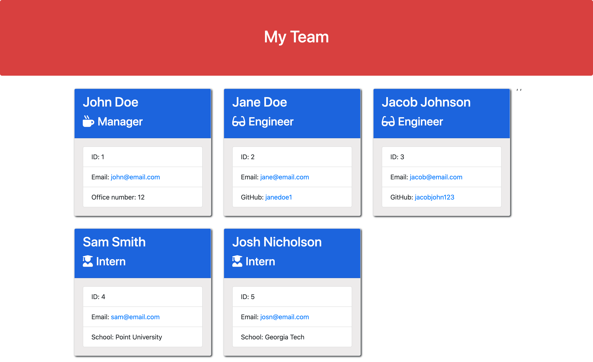

# Employee Tracker
      
    


## Description

This employee tracker app lets you keep your business team members and information orginaized. Simply answer the questions to add a manager and as many engineers and interns as your business needs/has. You can include the employees name, ID, email, office number, github account, or school if they are an intern. When you choose to stop adding employees, the app will compile all of the informatin into a professional looking, deployable HTML file. This app utilizes Node.js, Inquirer.js, classes, async functions, jest for testing, and much more.


​


​

## Table of Contents

* [Installation](#installation)
* [License](#license)
* [Tests](#tests)
* [Questions](#questions)


## Installation

To install necessary dependencies, run the following command:

``` npm i ```


## License

This project is licensed under the APACHE 2.0 license.


## Tests

To run tests, run the following command:

``` npm run test ```


## Questions

If you have any further questions, you can reach me directly here: lovins.jacob@yahoo.com

You can find more of my work at [https://github.com/jacoblovins/](https://github.com/jacoblovins/).
